# Database Design

> Section 15 of the assignment. PostgreSQL is the primary production database.

## Stack and tooling

- **Database:** PostgreSQL 15 (shared database shared-schema, see [Tenant isolation](#how-tenant-isolation-works)).
- **ORM:** Prisma 4 (`prisma-client-js`), with SQL migrations managed under `apps/api/prisma/migrations`.
- **Migration workflow:** `prisma migrate dev` during development; `prisma migrate deploy` in CI/production. Migrations are committed and applied in order; breaking schema changes ship as additive migrations with backfills (e.g. the Category promotion).
- **Seed:** `apps/api/prisma/seed.js` provisions the platform admin and the system `Platform` organization.

## How the minimum-entity list maps to the schema

The assignment asks for these minimum entities. The implementation keeps the same concepts but two names differ deliberately:

| Assignment entity | Implemented model | Notes |
|---|---|---|
| User | `User` | Platform-global identity; no tenant column. |
| Organization | `Organization` | Root tenant. Unique `slug`. |
| OrganizationMember | `UserOrganization` | Join/membership table mapping User→Organization with a `role`. |
| Role | `UserRole` **enum** | No separate `Role` table — see [Role design decision](#role-design-decision-userrole-enum-vs-a-separate-role-table). |
| Course | `Course` | Tenant-scoped; category via FK to `Category`. |
| Category | `Category` | Tenant-scoped; duplicate names/slugs prevented per organization. |
| Module | `Module` | `@@unique([courseId, order])`. |
| Lesson | `Lesson` | `@@unique([moduleId, order])`; resource attachments fields. |
| Quiz | `Quiz` | `@@unique([moduleId, order])`; timer, passing %, attempt limits. |
| Question | `Question` | `@@unique([quizId, order])`. |
| QuizOption | `QuizOption` | `@@index([questionId, order])`. |
| QuizAttempt | `QuizAttempt` | `@@unique([quizId, userId, attemptNumber])`. |
| Order | `Order` | Tenant-scoped; `@@index([userId, organizationId, status])`. |
| OrderItem | `OrderItem` | Denormalized `courseTitle` snapshot. |
| Payment | `Payment` | Denormalized `organizationId` (no FK, history-safe). |
| Enrollment | `Enrollment` | `@@unique([userId, courseId])`. |
| LessonProgress | `LessonProgress` | `@@unique([userId, lessonId])`. |
| CourseProgress | `CourseProgress` | `@@unique([userId, courseId])`. |
| Certificate | `Certificate` | `certificateId`/`verificationToken` unique; `@@unique([userId, courseId])`. |
| Notification | `Notification` | Tenant-scoped; `@@index([userId, organizationId])`. |
| AuditLog | `AuditLog` | Optionally tenant-scoped (nullable `organizationId`). |

## Entity Relationship Diagram

```mermaid
erDiagram
    Organization ||--o{ UserOrganization : "memberships"
    Organization ||--o{ Category : "owns"
    Organization ||--o{ Course : "owns"
    Organization ||--o{ Enrollment : "scope"
    Organization ||--o{ Notification : "scope"
    Organization ||--o{ Order : "scope"
    Organization ||--o{ Media : "owns"
    Organization ||--o{ Certificate : "scope"

    User ||--o{ UserOrganization : "belongs to"
    User ||--o{ Session : "has"
    User ||--o{ EmailVerificationToken : "has"
    User ||--o{ PasswordResetToken : "has"
    User ||--o{ Course : "instructs"
    User ||--o{ QuizAttempt : "takes"
    User ||--o{ Enrollment : "has"
    User ||--o{ Order : "places"
    User ||--o{ Payment : "pays"
    User ||--o{ LessonProgress : "tracks"
    User ||--o{ CourseProgress : "tracks"
    User ||--o{ Certificate : "earns"
    User ||--o{ Notification : "receives"
    User ||--o{ Media : "uploads"

    Organization {
        String id PK
        String name
        String slug UK "unique"
        OrganizationStatus status "ACTIVE | SUSPENDED"
        DateTime createdAt
        DateTime updatedAt
    }

    User {
        String id PK
        String name
        String email UK "unique"
        String passwordHash
        Boolean emailVerified
        DateTime createdAt
        DateTime updatedAt
    }

    UserOrganization {
        String id PK
        String userId FK "User.id"
        String organizationId FK "Organization.id"
        UserRole role "PLATFORM_ADMIN | ORG_ADMIN | INSTRUCTOR | STUDENT"
        DateTime createdAt
        DateTime updatedAt
    }

    Session {
        String id PK
        String userId FK "User.id"
        String tokenHash UK
        DateTime expiresAt
        Boolean revoked
    }

    EmailVerificationToken {
        String id PK
        String userId FK "User.id"
        String tokenHash UK
        Boolean used
    }

    PasswordResetToken {
        String id PK
        String userId FK "User.id"
        String tokenHash UK
        Boolean used
    }

    Category {
        String id PK
        String organizationId FK "Organization.id"
        String name "unique per (organizationId, name)"
        String slug "unique per (organizationId, slug)"
        String description
    }

    Course ||--o{ Module : "composed of"
    Course ||--o{ Enrollment : "enrolled in"
    Course ||--o{ OrderItem : "bought in"
    Course ||--o{ LessonProgress : "has"
    Course ||--o{ CourseProgress : "has"
    Course ||--o{ Certificate : "awarded for"
    Category ||--o{ Course : "classifies (SET NULL on category delete)"

    Course {
        String id PK
        String organizationId FK "Organization.id"
        String instructorUserId FK "User.id"
        String categoryId FK "Category.id, nullable, ON DELETE SET NULL"
        String title
        String slug "unique per (organizationId, slug)"
        String description
        Decimal price "Decimal(10,2)"
        Decimal discountPrice "Decimal(10,2)"
        CourseStatus status "DRAFT | REVIEW | PUBLISHED | ARCHIVED"
        DateTime publishedAt
        Int estimatedMinutes
        String difficulty
        String[] learningObjectives
    }

    Module ||--o{ Lesson : "contains"
    Module ||--o{ Quiz : "contains"

    Module {
        String id PK
        String courseId FK "Course.id"
        String title
        Int order "unique per (courseId, order)"
    }

    Lesson {
        String id PK
        String moduleId FK "Module.id"
        String title
        String content
        String type
        String resourceUrl
        String resourceMimeType
        Int duration
        Int order "unique per (moduleId, order)"
        Boolean isPreview
    }

    Quiz ||--o{ Question : "contains"
    Quiz ||--o{ QuizAttempt : "attempts"

    Quiz {
        String id PK
        String moduleId FK "Module.id"
        String title
        Int timeLimitMinutes
        Float passingPercentage
        Int maxAttempts
        Int order "unique per (moduleId, order)"
    }

    Question ||--o{ QuizOption : "has"

    Question {
        String id PK
        String quizId FK "Quiz.id"
        String questionText
        Int marks
        Int order "unique per (quizId, order)"
    }

    QuizOption {
        String id PK
        String questionId FK "Question.id"
        String text
        Boolean isCorrect
        Int order
    }

    QuizAttempt {
        String id PK
        String quizId FK "Quiz.id"
        String userId FK "User.id"
        Int attemptNumber "unique per (quizId, userId, attemptNumber)"
        Float score
        Int correctCount
        Int incorrectCount
        Float percentage
        Boolean passed
    }

    Enrollment {
        String id PK
        String userId FK "User.id"
        String courseId FK "Course.id"
        String organizationId FK "Organization.id"
        EnrollmentStatus status "ACTIVE | COMPLETED | DROPPED"
        DateTime enrolledAt
    }

    Order ||--o{ OrderItem : "line items"
    Order ||--o{ Payment : "payments"

    Order {
        String id PK
        String userId FK "User.id"
        String organizationId FK "Organization.id"
        OrderStatus status "PENDING | PAID | FAILED | CANCELLED | REFUNDED"
        Decimal totalAmount "Decimal(10,2)"
        String currency
    }

    OrderItem {
        String id PK
        String orderId FK "Order.id"
        String courseId FK "Course.id"
        String courseTitle "snapshot"
        Decimal unitPrice
        Int quantity
        Decimal lineTotal
    }

    Payment {
        String id PK
        String orderId FK "Order.id"
        String userId FK "User.id"
        String organizationId "denormalized (no FK)"
        String provider
        String providerRef
        Decimal amount
        PaymentStatus status "PENDING | SUCCEEDED | FAILED"
        DateTime paidAt
    }

    LessonProgress {
        String id PK
        String userId FK "User.id"
        String lessonId FK "Lesson.id"
        String moduleId FK "Module.id"
        String courseId FK "Course.id"
        String organizationId "denormalized"
        Boolean completed
        DateTime completedAt
    }

    CourseProgress {
        String id PK
        String userId FK "User.id"
        String courseId FK "Course.id"
        String organizationId "denormalized"
        String lastVisitedModuleId
        String lastVisitedLessonId
        Boolean completed
        DateTime completedAt
    }

    Certificate {
        String id PK
        String certificateId UK
        String verificationToken UK
        String userId FK "User.id"
        String courseId FK "Course.id"
        String organizationId FK "Organization.id"
        String organizationName "snapshot"
        String instructorUserId
        String instructorName "snapshot"
        String studentName "snapshot"
        String courseTitle "snapshot"
        DateTime completionDate
        String pdfUrl
    }

    Media {
        String id PK
        String organizationId FK "Organization.id"
        String uploaderId FK "User.id"
        String bucket
        String key UK
        String fileName
        String mimeType
        Int size
    }

    Notification {
        String id PK
        String userId FK "User.id"
        String organizationId FK "Organization.id"
        NotificationType type
        String title
        String body
        Json data
        DateTime readAt
    }

    AuditLog {
        String id PK
        String organizationId "nullable; NULL = platform-level"
        String actorUserId
        String actorEmail "snapshot"
        String actorRole "snapshot"
        String action
        String resourceType
        String resourceId
        Json metadata
        String ipAddress
        DateTime createdAt
    }
```

## Important indexes and tenant boundaries

All `id` columns are CUID primary keys (indexed automatically). The indexes below are the ones Prisma generates in addition to the PK.

| Table | Unique indexes | Non-unique indexes | Tenant boundary |
|---|---|---|---|
| Organization | `slug` | `status` | Root tenant (no parent). |
| User | `email` | — | Global (cross-tenant identity). |
| UserOrganization | `(userId, organizationId)` | `userId`, `organizationId`, `(organizationId, role)` | Join table carrying tenant + role. |
| Session | `tokenHash` | `userId` | — |
| EmailVerificationToken | `tokenHash` | `userId` | — |
| PasswordResetToken | `tokenHash` | `userId` | — |
| Category | `(organizationId, name)`, `(organizationId, slug)` | `organizationId` | `organizationId` required. |
| Course | `(organizationId, slug)` | `(organizationId, status)`, `categoryId` | `organizationId` required. |
| Module | `(courseId, order)` | — | Via Course. |
| Lesson | `(moduleId, order)` | — | Via Course. |
| Quiz | `(moduleId, order)` | — | Via Course. |
| Question | `(quizId, order)` | — | Via Course. |
| QuizOption | — | `(questionId, order)` | Via Course. |
| QuizAttempt | `(quizId, userId, attemptNumber)` | `(quizId, userId)`, `userId` | Via Course. |
| Enrollment | `(userId, courseId)` | `userId`, `courseId`, `organizationId` | `organizationId` required. |
| Order | — | `userId`, `organizationId`, `(userId, organizationId, status)` | `organizationId` required. |
| OrderItem | — | `orderId`, `courseId` | Via Order. |
| Payment | — | `orderId`, `userId`, `organizationId` | Denormalized `organizationId`. |
| LessonProgress | `(userId, lessonId)` | `userId`, `courseId`, `moduleId`, `organizationId`, `(userId, courseId)` | Denormalized `organizationId`. |
| CourseProgress | `(userId, courseId)` | `userId`, `courseId`, `organizationId` | Denormalized `organizationId`. |
| Certificate | `certificateId`, `verificationToken`, `(userId, courseId)` | `userId`, `courseId`, `organizationId` | `organizationId` required. |
| Notification | — | `(userId, organizationId)`, `(userId, readAt)`, `organizationId`, `type` | `organizationId` required. |
| Media | `key` | `organizationId`, `uploaderId` | `organizationId` required. |
| AuditLog | — | `(organizationId, createdAt)`, `(actorUserId, createdAt)`, `(action, createdAt)`, `(resourceType, resourceId)`, `createdAt` | Optional `organizationId` (NULL = platform-level). |

## Why the schema was selected

- **Shared database + tenant column.** The assignment explicitly allows a shared database with a `tenant_id` column and strong application-level enforcement. All tenant-scoped tables carry `organizationId`; rows belonging to different tenants only coexist because every repository query is scoped by `organizationId`. See [Tenant isolation](#how-tenant-isolation-works).
- **CUID primary keys.** Keys are generated outside the database (crypto-random, collision-safe), so we never leak ordering information, support horizontal/scaling decisions later, and avoid integer-sequence race conditions; default `NOW()` timestamps and cuid ids are set by the DB/Prisma.
- **Composite unique constraints enforce business rules at the database level** (tenant-scoped slug/name uniqueness, ordered-children uniqueness, per-user scoping) instead of relying only on application checks. See [Duplicate data prevention](#how-duplicate-data-is-prevented).
- **Denormalized snapshots for immutable history.** `Certificate.organizationName/instructorName/studentName/courseTitle`, `OrderItem.courseTitle`, `Payment.organizationId`, and `LessonProgress/CourseProgress.organizationId` are snapshots so that records remain meaningful even if the source entity is later renamed or removed, and so read paths (certificates, orders, audit logs) avoid extra joins.
- **De-normalized FKs for progress/payment** keep the hot student/learning and commerce paths single-table queries while data consistency is maintained inside transactions.
- **Enum-backed statuses** (`CourseStatus`, `OrderStatus`, `PaymentStatus`, `EnrollmentStatus`, `OrganizationStatus`) constrain legal transitions at the type layer; service code validates transitions (e.g. DRAFT→PUBLISHED) and sets `publishedAt`.
- **Optional/`SET NULL` relations where appropriate.** Deleting a `Category` leaves `Course.categoryId = NULL` (`ON DELETE SET NULL`) so courses survive category cleanup; deleting an organization cascades to all its tenant-scoped children (`ON DELETE CASCADE`).

## How tenant isolation works

1. **Membership model.** A user can belong to many organizations through `UserOrganization`; the `role` is carried per membership, so the same user can be a `STUDENT` in one org and an `ORG_ADMIN` in another.
2. **Request context.** `requireAuth` loads the session and user; `requireOrganizationContext` resolves the organization from `req.params.organizationId`, an `x-organization-id` header, query, or body, **verifies the caller actually belongs to that organization** (`userOrganization.findUnique` on `userId_organizationId`), and then sets `req.organizationId`. `requirePlatformAdmin` / `requireOrgAdmin` set `req.organizationId` from the caller's own membership — the client cannot steer it.
3. **Every repository call is scoped.** `findFirst`/`findMany` always include `where: { organizationId }`; mutations use `updateMany`/`deleteMany` with `organizationId` in the `where` and treat a `count === 0` as a 404. A caller who knows an ID in another tenant gets 404, not 403/200 — nothing leaks.
4. **Category → Course relation stays tenant-safe.** `resolveOrCreateCategoryId` only looks up/creates categories within the caller's `organizationId`, and the `(organizationId, name)` unique constraint is tenant-scoped. Search filters `where.organizationId = X AND where.category.name = '...'`, so the category relation can never pull a course or category across tenants.
5. **Audit logs.** Platform-admin events are recorded with `organizationId = NULL`; tenant-scoped events carry the org id, and platform audit endpoints (`/api/v1/admin/audit-logs`) are gated by `requirePlatformAdmin` while org audit endpoints (`/api/v1/org/audit-logs`) are gated by `requireOrgAdmin`.

## How duplicate data is prevented

Duplicate prevention is enforced at three layers:

1. **Database unique constraints** (authoritative):
   - `User.email`, `Organization.slug`, `Session.tokenHash`, `EmailVerificationToken.tokenHash`, `PasswordResetToken.tokenHash`.
   - `UserOrganization(userId, organizationId)` — one membership per user/org.
   - `Category(organizationId, name)` and `Category(organizationId, slug)` — duplicate category names/slugs are rejected **within the same organization** (application check is case-insensitive on name; the DB constraint backs it up).
   - `Course(organizationId, slug)` — slug uniqueness is per tenant.
   - `Module(courseId, order)`, `Lesson(moduleId, order)`, `Quiz(moduleId, order)`, `Question(quizId, order)` — positional integrity of content trees.
   - `QuizAttempt(quizId, userId, attemptNumber)` — no duplicate attempts.
   - `Enrollment(userId, courseId)`, `LessonProgress(userId, lessonId)`, `CourseProgress(userId, courseId)` — per-user deduplication.
   - `Certificate.certificateId`, `Certificate.verificationToken`, `Certificate(userId, courseId)` — one certificate per user/course and unforgeable verification codes.
   - `Media.key` — one object-storage key.
2. **Application-level pre-checks** return friendly 409s before touching the DB (e.g. `findByName(organizationId, name, { mode: 'insensitive' })` in `categoryService.assertNameAvailable`); Prisma `P2002` (unique violation) is caught and remapped to the same 409.
3. **Deterministic identifiers** (`slugify`-derived slugs, coupon/verification codes) reduce the surface for near-duplicates; category conflicts across spelling variants are ruled out by the case-insensitive application check plus the tenant-scoped unique constraint.

## How transactions are handled

- **Prisma interactive transactions.** Multi-row invariants run inside `prisma.$transaction(async (tx) => ...)`. The purchase flow (`orderRepository.createOrderWithPurchase`) atomically creates the `Order` (status `PAID`), the `OrderItem`, the `Payment`, and the `Enrollment` — if any insert fails, everything rolls back, so a student can never be charged without an enrollment or vice versa.
- **Best-effort side effects.** Audit-log recording (`auditLogService.record`) and notification dispatch (`notificationDispatcher.dispatchNotification`) are *outside* domain transactions: they run post-commit and any failure is caught and logged so it never fails the primary operation. The notification worker falls back to synchronous processing when the Redis queue is unavailable.
- **Concurrency-safe uniqueness.** All uniqueness is enforced by DB constraints, so parallel requests cannot both succeed; a second `create` in a race hits `P2002` and is mapped to the appropriate 409.
- **Delete strategy.** Tenant-scoped CASCADE (`Category`→none, `Organization`→children, `Course`→modules/lessons/quizzes/progress, `User`→sessions) keeps referential integrity on delete; `Course.categoryId` uses `ON DELETE SET NULL` to preserve courses when a category is removed.

## Role design decision: `UserRole` enum vs a separate `Role` table

The assignment lists `Role` as a minimum entity; the implementation stores roles as a **Prisma enum** (`UserRole`: `PLATFORM_ADMIN`, `ORG_ADMIN`, `INSTRUCTOR`, `STUDENT`) on the `UserOrganization` membership row instead of a separate `Role`/permission table.

- **Fixed, finite set.** The product has exactly four top-level roles. A role that cannot be created, renamed, or granted/revoked at runtime gains nothing from a relational table — the set is defined once in the DB enum and the Prisma client types.
- **Type safety.** Enums flow into the generated Prisma client and middleware (`ROLE_PRIORITY` in `src/middleware/auth.ts`), so a bad role string is a compile-time error rather than a runtime check.
- **Membership carries role.** Because roles live on `UserOrganization`, the *same user* can hold different roles in different organizations — exactly the multi-tenant model the app needs, without a join to a `Role`/`Permission` table.
- **Authorization is role-gated, not permission-gated.** The middleware checks `userLevel >= requiredLevel` against a fixed priority (STUDENT < INSTRUCTOR < ORG_ADMIN < PLATFORM_ADMIN), so a separate `permissions` table adds no capability today.
- **When a table would be justified.** If the app later needs runtime-managed/per-org-custom roles, granular permissions, or role hierarchies managed by admins, the correct evolution is to add a `Role` + `RolePermission` + `UserOrganizationRole` set — the current enum remains a documented, migration-friendly baseline.

## Migration history

| Migration | Synopsis |
|---|---|
| `20260821_init` | Users, organizations, auth tokens, sessions, base scaffolding. |
| `20260822_rbac` | `UserOrganization` membership + `UserRole` enum. |
| `20260822_rbac_organization_status` | `OrganizationStatus` enum. |
| `20260825_course_model` | Course/module/lesson model (free-text `category` column initially). |
| `20260827_enrollment` | Enrollment entity. |
| `20260827_quiz_engine` | Quiz, question, quiz option, quiz attempt. |
| `20260828_certificate` | Certificate entity (PDF + verification). |
| `20260828_commerce` | Order, order item, payment. |
| `20260828_file_storage` | Media entity + object-storage fields on course/lesson. |
| `20260828_notifications` | Notification entity. |
| `20260828_progress` | LessonProgress + CourseProgress. |
| `20260829_audit_log` | AuditLog entity. |
| `20260829_categories` | Category entity + **backfill**: promotes existing free-text `Course.category` values into `Category` rows (per organization), links `Course.categoryId`, then drops the `category` column. Idempotent-safe: the unique promo keys are deterministic (per-org name hash). |